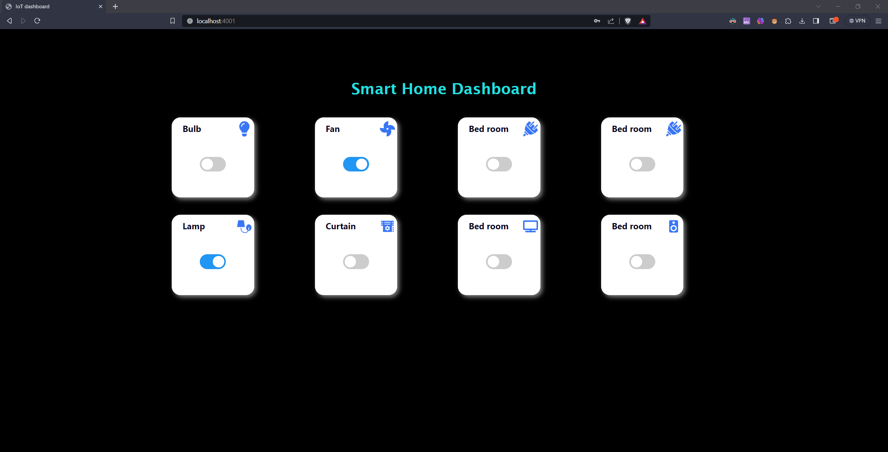

# Smart Home Dashboard

This project focuses on developing a Smart Home Dashboard for controlling ESP-based home automation devices. The dashboard provides an intuitive interface for managing various IoT devices and is built using JavaScript, Express.js, Socket.io, and Firebase.


## Features

- **Device Control:** Easily control and monitor ESP-based home automation devices.
- **Real-Time Updates:** Utilizes Socket.io for real-time updates and synchronization.
- **User Authentication:** Firebase authentication ensures secure user access.
- **Responsive Design:** Ensures a seamless experience across different devices.

## Technologies Used

- JavaScript
- Express.js
- Socket.io
- Firebase


## Installation

To run this project locally, follow these steps:

1. Clone this repository:

   ```bash
   git clone https://github.com/yourusername/smart-home-dashboard.git


2. Navigate to the project directory

   ```bash
   cd smart-home-dashboard

3. Install dependencies

   ```bash 
   npm install

4. Start the server

    ```bash
    npm start
5. Access the dashboard in your web browser at http://localhost:4001.


## Screenshot




